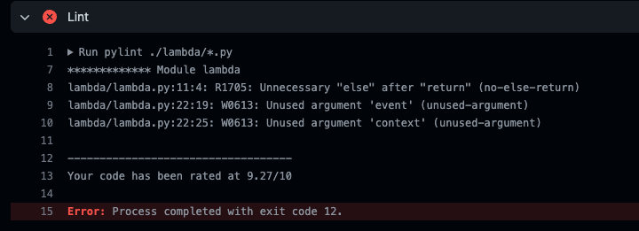
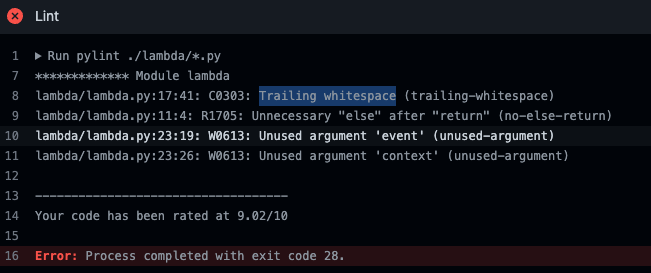

# Workshop Steps

## Infrastructure as Code (cloudformation)

1. Github actions pipeline or workflows are define under specific file structure `.github/workflows`. Pipeline is defined on file `ci-iac.yml`, create the file if there is no present: `touch .github/workflows/ci-iac.yml` . 
2. Identify programming errors, bugs, stylistic errors and suspicious constructs by adding Linter or **lint job**.
   1. Copy the following code to pipeline file created:

      ```yml
      name: CI Infra as Code

      on:
        [workflow_dispatch, push]

      concurrency: ci-${{ github.ref }}

      jobs:

        lint:
          name: CloudFormation Linter
          runs-on: ubuntu-latest
          steps:
            - name: Check out Git repository
              uses: actions/checkout@v3
              
            - name: Setup CloudFormation Linter with Latest Version
              uses: scottbrenner/cfn-lint-action@v2

            - name: Lint CloudFormation files.
              run: |
                cfn-lint --version
                cfn-lint -t cfn/*.y*ml -I

      ```

   2. Push your changes.
   3. Check output to identify possible errors. 
   4. Fix the issue by creating `.cfnlintrc.yml` with the following content:

      ```yml
      ignore_checks:
        - W3002 # This code may only work with `package` cli command as the property (Resources/emailSender/Properties/Code) is a string
      ```

   5. Save and push your changes.
   <br/>
   <br/>
3. Implement Security Scanner: *Aqua Security Trivy*
   1. Add the following code to our pipeline file created `ci-backend.yml`:
      ```yml
      trivy:
        name: Run Trivy (Iac and fs mode)
        runs-on: ubuntu-latest
        steps:
          - name: Check out Git repository
            uses: actions/checkout@v3

          # Trivy scans Infrastructure as Code (IaC) Terraform, CloudFormation, Dockerfile and Kubernetes.
          - name: Run Trivy vulnerability scanner in IaC mode
            uses: aquasecurity/trivy-action@master
            with:
              scan-type: 'config'
              hide-progress: false
              format: 'table'
              exit-code: '1'
              ignore-unfixed: false
              severity: 'UNKNOWN,LOW,MEDIUM,HIGH,CRITICAL'

          - name: Run Trivy vulnerability scanner in fs mode
            uses: aquasecurity/trivy-action@master
            with:
              scan-type: 'fs'
              hide-progress: false
              format: 'table'
              exit-code: '1'
              ignore-unfixed: true
              severity: 'UNKNOWN,LOW,MEDIUM,HIGH,CRITICAL'
      ```
      2. Save and push your changes.
      3. Check output for possible vulnerabilities.
      4. If no errors, let's continue!!.
   <br/>
   <br/>
4. Let's look for patterns in CloudFormation templates that may indicate insecure infrastructure.
   1. Add the following code to pipeline file created:
      ```yml
        insecure-cf:
          name: Scan Insecure Cloudformation patterns
          runs-on: ubuntu-latest
          steps:
            - name: Check out Git repository
              uses: actions/checkout@v3

            - name: Insecure Cloudformation patterns
              uses: stelligent/cfn_nag@master
              with:
                input_path: cfn
                extra_args: --fail-on-warnings --blacklist-path .cfnnagcfg.yml

            - name: Fail if cfn_nag scan contains failures, warnings
              # sum cfn_nag failures, warnigns and return it as exit code
              run: |
                exit `grep -E '^(Failures|Warnings)' cfn_nag.out | awk '{ SUM += $3} END { print SUM }'`
      ```
   2. Push your changes.
   3. Check output to identify possible errors. 
   4. Fix the issue by creating `.trivyignore` at root level of your repo with the following content:
   
      Reference link: [trivy DS-0002](https://avd.aquasec.com/misconfig/dockerfile/general/avd-ds-0002/)

      ```yml
      # Running containers with 'root' user can lead to a container escape situation. It is a best practice to run containers as non-root users, which can be done by adding a 'USER' statement to the Dockerfile.
      DS002
      ```
    1. Commit and Push your changes. 
    2. If no errors, let's continue!!.
<br/>
<br/>

5. *Checkov*: Policy-as-code. Scans cloud infrastructure configurations to find misconfigurations.
   1. Add the following code to pipeline file created:
      ```yml
      Checkov:
        name: Checkov - Security Analysis of Cloudformation
        runs-on: ubuntu-latest
        steps:
          - name: Check out Git repository
            uses: actions/checkout@v3

          - name: Run Checkov action
            id: checkov
            uses: bridgecrewio/checkov-action@master
            with:
              directory: cfn/
              quiet: false # optional: display only failed checks
              soft_fail: false # optional: do not return an error code if there are failed checks
              skip_check: CKV_AWS_115,CKV_AWS_116,CKV_AWS_173,CKV_AWS_260
      ```
    2. Commit and Push your changes. 
    3. If no errors, let's continue!!.
<br/>
<br/>

6. Add last step to validate all previous steps are completed `[checkov,insecure-cf,trivy,lint]`, if any of those fail it will not complete.
   1. Add the following code to pipeline file created:
      ```yml
        deploy:
          name: deploy 
          needs: [checkov,insecure-cf,trivy,lint]
          runs-on: ubuntu-latest
          steps:
            - name: Deploy the thing
              run: |
                echo Deploying 🚀
      ```
<br/>

## Application Code (Backend on Python)

1. Add Gitleaks docker execution. This tool helps in detecting and preventing hardcoded secrets like passwords, api keys, and tokens in git.
   1. Add the following code to pipeline file created:
      ```yml
        name: CI Backend
        on:
          [workflow_dispatch, push]

        concurrency: ci-backend-${{ github.ref }}

        jobs:

          gitleaks:
            name: gitleaks
            runs-on: ubuntu-latest
            steps:
              - uses: actions/checkout@v3
                with:
                  fetch-depth: 0
              
              - name: run gitleaks docker
                run: |
                  docker run -v ${PWD}:/path zricethezav/gitleaks:latest detect --source="/path/" -v -l debug --no-git
      ```
   2. Push your changes.
   3. Check output to identify possible errors. 
   4. Fix the issue based on gitleaks results, check for parameters found: *Finding*,*Secret*,*File*,*Line*.
   
   5. Push your changes and validate outputs.
<br/>
<br/>

2. Lets add file `.pylintrc` to repo structure and move on the warnings showed on outputs.
   
   2. This time we will wait to complete step #3 to push our changes.

3. Let's run a Lint test to our code again, add the below job to `ci-backend.yml` file.
   1. Add following code:
      ```yml
      lint:
        name: Lint
        runs-on: ubuntu-latest
        #env:
        needs: [gitleaks]
        #  FLASK_ENV: development
        steps:
          - name: checkout git repository
            uses: actions/checkout@v3

          - name: Setup Python 3.8
            uses: actions/setup-python@v3
            with:
              python-version: "3.8"

          - name: Install dependencies
            run: pip install -r requirements.txt

          - name: Lint
            run: pylint ./lambda/*.py
      ```
   2. Check output to identify possible errors.
   
   1. Fix the issue by removing Trailing whitespace on `lambda.py`.
   <br/>
   <br/>
4. Lets run a security check to our repository by using PyCharm Security.
   1. Add the bellow code to the `ci-backend.yml` file:
      ```yml
      security-checks:
        runs-on: ubuntu-latest
        needs: [gitleaks]
        name: Pycharm-security check
        steps:
          - name: checkout git repository
            uses: actions/checkout@v3

          - name: Run PyCharm Security
            uses: tonybaloney/pycharm-security@master
      ```
    1. Save and Push your changes.
    2. Check on outputs on Pycharm-security check
    3. Please notice pipeline continues even with warning, this behaviour can be configure with the below code: *****
   
    1. **Missing steps to cover asserts warinings??**********
<br/>
<br/>

5. Add Trufflehog job to scan filesystem to discover vulnerabilities.
   1. Add the bellow code to the `ci-backend.yml` file:
      ```yml
        TruffleHog:
          runs-on: ubuntu-latest
          steps:
            - name: Checkout code
              uses: actions/checkout@v3
              with:
                fetch-depth: 0

            - name: TruffleHog
              run: |
                docker run -v ${PWD}:/truffle trufflesecurity/trufflehog:latest filesystem --directory="/truffle/"
      ```
   2. Check output to identify possible errors.
<br/>
<br/>

6. **do we need to include grype without report??***** Add Grype (Anchore) Project Scan.
   1. Add the bellow code to the `ci-backend.yml` file:
      ```yml
      docker-grype-project:
        name: Grype (Anchore) Project Scan
        needs: [gitleaks]
        runs-on: ubuntu-latest
        steps:
          - name: Check out Git repository
            uses: actions/checkout@v3

          - name: Scan current project with Grype (Anchore)
            id: scan-project
            uses: anchore/scan-action@v3
            with:
              path: "."
              fail-build: false
          # Advanced Security in Github must be enabled for this repository to upload report.
          # - name: upload Anchore scan SARIF report
          #   uses: github/codeql-action/upload-sarif@v2
          #   with:
          #     sarif_file: ${{ steps.scan-project.outputs.sarif }}
      ```
   2. Check output to identify possible errors.
   3. Save and push your changes
   <br/>
   <br/>
7. Now, lets create our Docker image.
   1. Add docker build job code to `ci-backend.yml` file:
      ```yml
      docker-build:
        name: Build Docker image
        outputs:
          full_docker_image_tag: ${{ steps.build_image.outputs.full_docker_image_tag }}
          image_tag: ${{ steps.build_image.outputs.image_tag }}
        runs-on: ubuntu-latest
        needs: [security-checks, unit-tests-and-coverage, lint, docker-grype-project]
        steps:
          - name: Check out Git repository
            uses: actions/checkout@v3

          - name: Add SHORT_SHA and BRANCH_TAG env variables
            run: |
              echo "SHORT_SHA=`echo ${GITHUB_SHA} | cut -c1-8`" >> $GITHUB_ENV
              echo "BRANCH_TAG=`echo ${GITHUB_REF##*/}`" >> $GITHUB_ENV

          - name: Set IMAGE_TAG env variable
            run: |
              echo "IMAGE_TAG=`echo ${BRANCH_TAG}-${SHORT_SHA}`" >> $GITHUB_ENV

          - name: Build and tag image
            id: build_image
            env:
              REGISTRY: ghcr.io
              IMAGE_NAME: ${{ github.repository }}
              ECR_REPOSITORY: ${{ github.repository }}
              IMAGE_TAG: ${{ env.IMAGE_TAG }}
            run: |
              echo REGISTRY: $REGISTRY
              echo ECR_REPOSITORY: $ECR_REPOSITORY
              echo IMAGE_TAG: $IMAGE_TAG
              echo "Building and tagging $REGISTRY/$ECR_REPOSITORY:$IMAGE_TAG ..."
              docker build -t $REGISTRY/$ECR_REPOSITORY:$IMAGE_TAG -f Dockerfile .
              mkdir -p /tmp
              docker save "$REGISTRY/$ECR_REPOSITORY:$IMAGE_TAG" > /tmp/docker-image.tar
              echo "full_docker_image_tag=$REGISTRY/$ECR_REPOSITORY:$IMAGE_TAG" >> $GITHUB_OUTPUT
              echo "image_tag=$IMAGE_TAG" >> $GITHUB_OUTPUT

          - name: Upload artifact
            uses: actions/upload-artifact@v2
            with:
              name: docker-image
              path: /tmp/docker-image.tar
              retention-days: 1
      ```
8. Lets scan our Docker image for vulnerabilities, add *Docker-trivy-vul* job to pipeline.
   1. Add docker trivy job to `ci-backend.yml` file:
      ```yml
      docker-trivy-vuln:
        name: Trivy vulnerability scanner
        runs-on: ubuntu-latest
        needs: [docker-build]
        steps:
          - name: Download artifact
            uses: actions/download-artifact@v3
            with:
              name: docker-image
              path: /tmp
          - name: Load Docker image
            run: |
              docker load --input /tmp/docker-image.tar

          - name: Run Trivy vulnerability scanner
            uses: aquasecurity/trivy-action@master
            with:
              image-ref: "${{ needs.docker-build.outputs.full_docker_image_tag }}"
              format: "template"
              template: "@/contrib/sarif.tpl"
              output: "trivy-results.sarif"
              exit-code: "0"
              ignore-unfixed: true
              vuln-type: "os,library"
              severity: "UNKNOWN,LOW,MEDIUM,HIGH,CRITICAL"
      ```
    2. Push your changes.
    3. If no issues, let's continue.
<br/>
<br/>

9. Lets invoke our vulnerability scanner for container images - *Grype*:
    1.  Add below code to our `ci-backend.yml` file:
        ```yml
          docker-grype:
            name: Grype (Anchore) Docker Scan
            runs-on: ubuntu-latest
            needs: [docker-build]
            steps:
              - name: Download artifact
                uses: actions/download-artifact@v2
                with:
                  name: docker-image
                  path: /tmp

              - name: Load Docker image
                run: |
                  docker load --input /tmp/docker-image.tar

              - name: Scan image wih Grype (Anchore)
                id: scan-image
                uses: anchore/scan-action@v3
                with:
                  image: "${{ needs.docker-build.outputs.full_docker_image_tag }}"
                  fail-build: false
        ```
    2. Push your changes.
    3. If no issues, let's continue.
<br/>
<br/>

1.  Our final step is a validation job which depends on previous security scans in order to complete:
    1. Add the below job and push your changes:
      ```yml
        deploy:
          name: Push 
          runs-on: ubuntu-latest
          needs: [docker-grype,docker-trivy-vuln]
          steps:
            - name: Deploy the thing
              run: |
                echo Deploying 🚀
      ```
2.  Happy deploy... 🚀