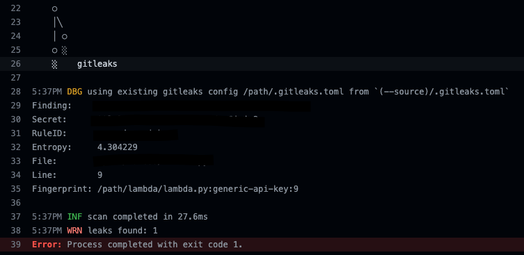

# Workshop Steps

## Infrastructure as Code (cloudformation)

1. Github actions pipeline or workflows are define under specific file structure `.github/workflows`. Pipeline is defined on file `ci-iac.yml`, create the file if there is no present: `touch .github/workflows/ci-iac.yml` . 
2. Identify programming errors, bugs, stylistic errors and suspicious constructs by adding Linter or **lint job**.
   1. Copy the following code to pipeline file created:

      ```yml
      name: CI Infra as Code

      on:
        [workflow_dispatch, push]

      concurrency: ci-${{ github.ref }}

      jobs:

        lint:
          name: CloudFormation Linter
          runs-on: ubuntu-latest
          steps:
            - name: Check out Git repository
              uses: actions/checkout@v3
              
            - name: Setup CloudFormation Linter with Latest Version
              uses: scottbrenner/cfn-lint-action@v2

            - name: Lint CloudFormation files.
              run: |
                cfn-lint --version
                cfn-lint -t cfn/*.y*ml -I

      ```

   2. Push your changes.
   3. Check output to identify possible errors. 
   4. Fix the issue by creating `.cfnlintrc.yml` with the following content:

      ```yml
      ignore_checks:
        - W3002 # This code may only work with `package` cli command as the property (Resources/emailSender/Properties/Code) is a string
      ```

   5. Save and push your changes
3. Implement Security Scanner: *Tryvy*
      1. Add the following code to pipeline file created:
      ```yml
      trivy:
        name: Run Trivy (Iac and fs mode)
        runs-on: ubuntu-latest
        steps:
          - name: Check out Git repository
            uses: actions/checkout@v3

          # Trivy scans Infrastructure as Code (IaC) Terraform, CloudFormation, Dockerfile and Kubernetes.
          - name: Run Trivy vulnerability scanner in IaC mode
            uses: aquasecurity/trivy-action@master
            with:
              scan-type: 'config'
              hide-progress: false
              format: 'table'
              exit-code: '1'
              ignore-unfixed: false
              severity: 'UNKNOWN,LOW,MEDIUM,HIGH,CRITICAL'

          - name: Run Trivy vulnerability scanner in fs mode
            uses: aquasecurity/trivy-action@master
            with:
              scan-type: 'fs'
              hide-progress: false
              format: 'table'
              exit-code: '1'
              ignore-unfixed: true
              severity: 'UNKNOWN,LOW,MEDIUM,HIGH,CRITICAL'
      ```
4. Let's look for patterns in CloudFormation templates that may indicate insecure infrastructure.
   1. Add the following code to pipeline file created:
   ```yml
    insecure-cf:
      name: Scan Insecure Cloudformation patterns
      runs-on: ubuntu-latest
      steps:
        - name: Check out Git repository
          uses: actions/checkout@v3

        - name: Insecure Cloudformation patterns
          uses: stelligent/cfn_nag@master
          with:
            input_path: cfn
            extra_args: --fail-on-warnings --blacklist-path .cfnnagcfg.yml

        - name: Fail if cfn_nag scan contains failures, warnings
          # sum cfn_nag failures, warnigns and return it as exit code
          run: |
            exit `grep -E '^(Failures|Warnings)' cfn_nag.out | awk '{ SUM += $3} END { print SUM }'`
   ```
   2. Push your changes.
   3. Check output to identify possible errors. 
   4. Fix the issue by creating `.trivyignore` with the following content:
   
      Reference link: [trivy DS-0002](https://avd.aquasec.com/misconfig/dockerfile/general/avd-ds-0002/)

      ```yml
      # Running containers with 'root' user can lead to a container escape situation. It is a best practice to run containers as non-root users, which can be done by adding a 'USER' statement to the Dockerfile.
      DS002
      ```
    5. Commit and Push your changes.  

   
5. *Checkov*: Policy-as-code .
   1. Add the following code to pipeline file created:
   ```yml
    Checkov:
      name: Checkov - Security Analysis of Cloudformation
      runs-on: ubuntu-latest
      steps:
        - name: Check out Git repository
          uses: actions/checkout@v3

        - name: Run Checkov action
          id: checkov
          uses: bridgecrewio/checkov-action@master
          with:
            directory: cfn/
            quiet: false # optional: display only failed checks
            soft_fail: false # optional: do not return an error code if there are failed checks
            skip_check: CKV_AWS_115,CKV_AWS_116,CKV_AWS_173,CKV_AWS_260
            # framework: cloudformation # optional: run only on a specific infrastructure {cloudformation,terraform,kubernetes,all}
            # output_format: json # optional: the output format, one of: cli, json, junitxml, github_failed_only
            # download_external_modules: true # optional: download external terraform modules from public git repositories and terraform registry
            # # log_level: DEBUG # optional: set log level. Default WARNING
            # baseline: cloudformation/.checkov.baseline # optional: Path to a generated baseline file. Will only report results not in the baseline.
    ```
  
6. Add last step to validate all previous steps are completed `[checkov,insecure-cf,trivy,lint]`, if any of those fail it will not complete.
   1. Add the following code to pipeline file created:
   ```yml
    deploy:
      name: deploy 
      needs: [checkov,insecure-cf,trivy,lint]
      runs-on: ubuntu-latest
      steps:
        - name: Deploy the thing
          run: |
            echo Deploying 🚀
   ```

    
## Application Code (Backend on Python)

1. Add Gitleaks docker execution. This tool helps in detecting and preventing hardcoded secrets like passwords, api keys, and tokens in git.
   1. Add the following code to pipeline file created:
   ```yml
    name: CI Backend
    on:
      [workflow_dispatch, push]

    concurrency: ci-backend-${{ github.ref }}

    jobs:

      gitleaks:
        name: gitleaks
        runs-on: ubuntu-latest
        steps:
          - uses: actions/checkout@v3
            with:
              fetch-depth: 0
          
          - name: run gitleaks docker
            run: |
              docker run -v ${PWD}:/path zricethezav/gitleaks:latest detect --source="/path/" -v -l debug --no-git
   ```
   1. Push your changes.
   2. Check output to identify possible errors. 
   3. Fix the issue based on gitleaks results, check for parameters found: Finding, Secret,File,Line.
   
   4. Push your changes and validate outputs.


2. Copy `/tests` directory to repo.
3. add `pylintrc` to repo structure
4. Run unit test and add pytest coverage on PR.:
   ```yml
    unit-tests-and-coverage:
      name: Tests and coverage
      runs-on: ubuntu-latest
      needs: [gitleaks]
      env:
        FLASK_ENV: development
      steps:
        - name: checkout git repository
          uses: actions/checkout@v3

        - name: Setup Python 3.8
          uses: actions/setup-python@v3
          with:
            python-version: "3.8"

        - name: Install dependencies
          run: pip install -r requirements.txt

        # - name: Execute unit tests and generate coverage file
        #   run: |
        #     bash ./scripts/run_test.sh


        - name: Comment coverage
          uses: coroo/pytest-coverage-commentator@v1.0.2
          with:
            pytest-coverage: pytest-coverage.txt   
   ```
   1. Add the following code to pipeline file created:
 
