- [Workshop Steps](#workshop-steps)
  - [Infrastructure as Code (cloudformation)](#infrastructure-as-code-cloudformation)
    - [Trivy](#trivy-)
    - [cfn\_nag](#cfn_nag-)
    - [Checkov](#checkov-)
    - [Deploy Infra 🚀](#deploy-infra-)
  - [Application Code (Python 🐍)](#application-code-python-)
    - [Gitleaks](#gitleaks-)
    - [Pycharm Security](#pycharm-security-)
    - [Grype (Anchore)](#grype-anchore-)
    - [Build docker image](#build-docker-image-)
    - [docker-trivy](#docker-trivy-)
    - [docker-grype](#docker-grype-)
    - [Deploy Application 🚀](#deploy-application-)
  - [Bonus: pre-commit](#bonus-pre-commit)

# Workshop Steps

## Infrastructure as Code (cloudformation)

1. Create a new repo using the workshop repo template: https://github.com/WizelineLabs/vulnerabilities-scanner-template.
    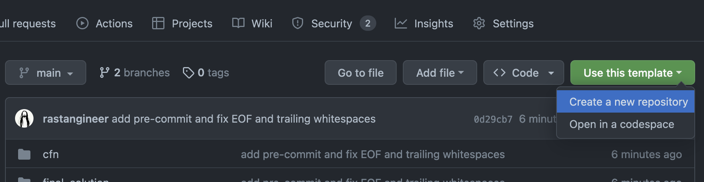
    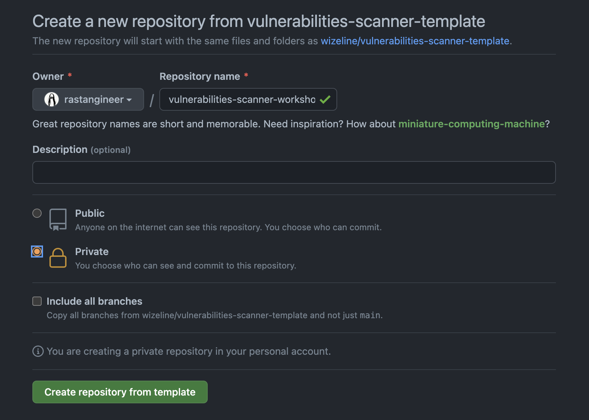
2. This template contains:
   1. Sample cloudformation code
   2. Sample python code that is going to be deployed as lambdas
   3. Sample dockerized app
3. Clone the repo to your machine and opent it in your prefered editor or edit it directly on the browser by hitting `.` (dot) key on your keyboard.

4. Please note directory `/final_solution/` contains all demo files in its final stage, meaning you can easily copy and paste the respective files by following the instructions here and be able to proceed with pipeline without any failures, however we strongly suggest to follow along to see every step for each tool fail, and it's respective solution accordingly.
5. Create the IaC workflow on: `.github/workflows/ci-iac.yml`.


### Trivy [🔗](https://github.com/marketplace/actions/aqua-security-trivy)

- Implement Security Scanner: *Aqua Security Trivy*

1. Add the following code to your pipeline file `.github/workflows/ci-iac.yml`:

    ```yml
    name: CI Infra as Code
    on:
      [workflow_dispatch, push]
    concurrency: ci-${{ github.ref }}
    jobs:

      trivy:
        name: Run Trivy (Iac and fs mode)
        runs-on: ubuntu-latest
        steps:
          - name: Check out Git repository
            uses: actions/checkout@v3

          # Trivy scans Infrastructure as Code (IaC) Terraform, CloudFormation, Dockerfile and Kubernetes.
          - name: Run Trivy vulnerability scanner in IaC mode
            uses: aquasecurity/trivy-action@master
            with:
              scan-type: 'config'
              hide-progress: false
              format: 'table'
              exit-code: '1'
              ignore-unfixed: false
              severity: 'UNKNOWN,LOW,MEDIUM,HIGH,CRITICAL'

          - name: Run Trivy vulnerability scanner in fs mode
            uses: aquasecurity/trivy-action@master
            with:
              scan-type: 'fs'
              hide-progress: false
              format: 'table'
              exit-code: '1'
              ignore-unfixed: false
              severity: 'UNKNOWN,LOW,MEDIUM,HIGH,CRITICAL'
    ```

2. Save and push your changes.
3. Check output for possible vulnerabilities.
    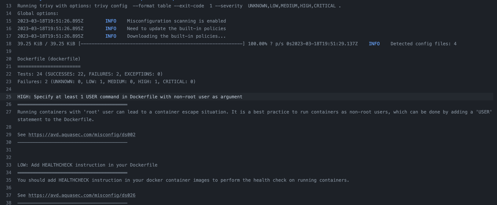
4. If pipeline failed for flag: *Image user should not be ‘root’* Reference Link: https://avd.aquasec.com/misconfig/ds002
5. Fix the issue by creating a file named `.trivyignore` at root level of your repository and add the following content:

    ```yml
    # Running containers with 'root' user can lead to a container escape situation. It is a best practice to run containers as non-root users, which can be done by adding a 'USER' statement to the Dockerfile.
    DS002
    ```

    Reference link: [trivy DS-0002](https://avd.aquasec.com/misconfig/dockerfile/general/avd-ds-0002/)

6. Save and push your changes and check output pipeline status.

    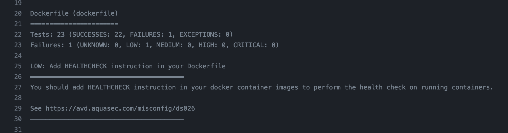

7. Remove `UNKNOWN, LOW` from `severity`. You should have something like this:

    ```yml
          - name: Run Trivy vulnerability scanner in IaC mode
            uses: aquasecurity/trivy-action@master
            with:
              scan-type: 'config'
              hide-progress: false
              format: 'table'
              exit-code: '1'
              ignore-unfixed: false
              severity: 'MEDIUM,HIGH,CRITICAL'

          - name: Run Trivy vulnerability scanner in fs mode
            uses: aquasecurity/trivy-action@master
            with:
              scan-type: 'fs'
              hide-progress: false
              format: 'table'
              exit-code: '1'
              ignore-unfixed: false
              severity: 'MEDIUM,HIGH,CRITICAL'
    ```

8. Push changes and check the pipeline log.
9. Trivy possibly identified a vulnerability with CVE-2022-42969, you can find more details [HERE](https://avd.aquasec.com/nvd/2022/cve-2022-42969/). You can deep dive into the subject on your own:

    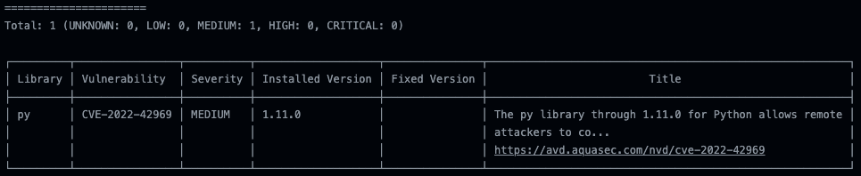

    For now, let's ignore this flag by changing a value under trivy scanner fs mode code, by setting `ignore-unfixed: true`

    ```yml
          - name: Run Trivy vulnerability scanner in fs mode
            uses: aquasecurity/trivy-action@master
            with:
              scan-type: 'fs'
              hide-progress: false
              format: 'table'
              exit-code: '1'
              ignore-unfixed: true
              severity: 'MEDIUM,HIGH,CRITICAL'
    ```

### cfn_nag [🔗](https://github.com/stelligent/cfn_nag)

- In this step, let's look for patterns in our CloudFormation templates that may indicate insecure infrastructure, we will use ***stelligent/cfn_nag*** in our pipeline for this purpose.

1. Add the following code to pipeline file `.github/workflows/ci-iac.yml`:

    ```yml
      insecure-cf:
        name: Scan Insecure Cloudformation patterns
        runs-on: ubuntu-latest
        steps:
          - name: Check out Git repository
            uses: actions/checkout@v3

          - name: Insecure Cloudformation patterns
            uses: stelligent/cfn_nag@master
            with:
              input_path: cfn
              extra_args: --fail-on-warnings

          - name: Fail if cfn_nag scan contains failures, warnings
            # sum cfn_nag failures, warnigns and return it as exit code
            run: |
              exit `grep -E '^(Failures|Warnings)' cfn_nag.out | awk '{ SUM += $3} END { print SUM }'`
    ```

2. Push your changes.
3. Check scan resultset, notice the different warinings listed and create a plan of action on a real environment; For now, lets skip the warnings in order to continue.

    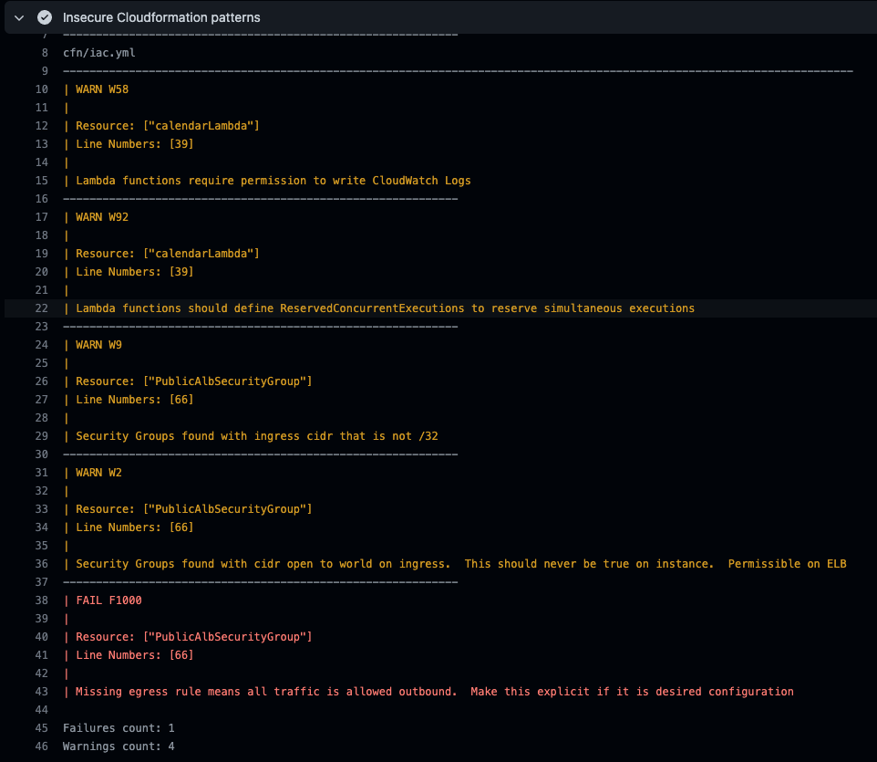

4. Add an exception file for those warinings at repository root level named `.cfnnagcfg.yml` or using command-line `touch .cfnnagcfg.yml` and add the below rules to supress on scan:

    ```yml
    ---
    RulesToSuppress:
    - id: W2
      reason: Security Groups found with cidr open to world on ingress.  This should never be true on instance.  Permissible on ELB
    - id: W9
      reason: Security Groups found with ingress cidr that is not /32
    - id: W58
      reason: Lambda functions require permission to write CloudWatch Logs
    - id: W92
      reason: Lambda functions should define ReservedConcurrentExecutions to reserve simultaneous executions
    - id: F1000
      reason: Missing egress rule means all traffic is allowed outbound.  Make this explicit if it is desired configuration
    ```

5. Lets add an additional extra argumement `--deny-list-path .cfnnagcfg.yml` to the job to consider the exception file:

    ```yml
          - name: Insecure Cloudformation patterns
            uses: stelligent/cfn_nag@master
            with:
              input_path: cfn
              extra_args: --fail-on-warnings --deny-list-path .cfnnagcfg.yml
    ```

6. Save and Push your changes.
7. If no errors, let's continue...

### Checkov [🔗](https://github.com/bridgecrewio/checkov-action)

- *checkov*: Policy-as-code. Scans cloud infrastructure configurations to find misconfigurations.

1. Add the following code to pipeline file created:

    ```yml
      checkov:
        name: checkov - Security Analysis of Cloudformation
        runs-on: ubuntu-latest
        steps:
          - name: Check out Git repository
            uses: actions/checkout@v3

          - name: Run Checkov action
            id: checkov
            uses: bridgecrewio/checkov-action@master
            with:
              directory: cfn/
              quiet: false # optional: display only failed checks
              soft_fail: false # optional: do not return an error code if there are failed checks
              #skip_check: CKV_AWS_115,CKV_AWS_116,CKV_AWS_173,CKV_AWS_260
      ```

2. Commit and Push your changes.
3. Static security analysis show diffent validation flags from the scan.

    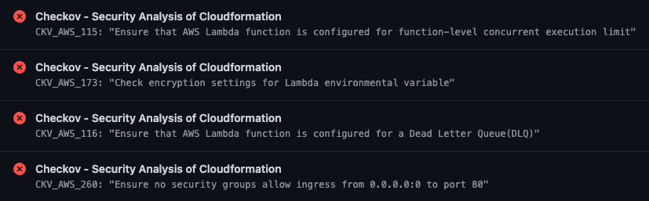

4. For thew purpose of the demo, we will skip those flags by uncomment the parameter *skip_check* as below:

    ```yml
          - name: Run Checkov action
            id: checkov
            uses: bridgecrewio/checkov-action@master
              with:
              directory: cfn/
              quiet: false # optional: display only failed checks
              soft_fail: false # optional: do not return an error code if there are failed checks
              skip_check: CKV_AWS_115,CKV_AWS_116,CKV_AWS_173,CKV_AWS_260
    ```

5. Save and push your changes.
6. If no errors, let's continue...

### Deploy Infra 🚀

- As last step lets add all the previous jobs as pre-requisites for deploy

1. Add the following code to pipeline file created:

    ```yml
      deploy:
        name: deploy 🚀
        needs: [checkov,insecure-cf,trivy]
        runs-on: ubuntu-latest
        steps:
          - name: Deploy the thing
            run: |
              echo Deploying 🚀
    ```

## Application Code (Python 🐍)

Let's now create our CI pipeline for the application and explore the different tools that will help you to secure your deployments and pipelines.

1. Let's start by creating our pipeline file `.github/workflows/ci-app.yml`.

### Gitleaks [🔗](https://github.com/zricethezav/gitleaks)

- ***Gitleaks***: This tool helps in detecting and preventing hardcoded secrets like passwords, api keys, and tokens in git.

1. Add the following code to pipeline file `.github/workflows/ci-app.yml`:

    ```yml
    name: CI App
    on:
      [workflow_dispatch, push]
    concurrency: ci-app-${{ github.ref }}
    jobs:
      gitleaks:
        name: gitleaks
        runs-on: ubuntu-latest
        steps:
          - uses: actions/checkout@v3
            with:
              fetch-depth: 0

          - name: run gitleaks docker
            run: |
              docker run -v ${PWD}:/path zricethezav/gitleaks:latest detect --source="/path/" -v -l debug --no-git
    ```

2. Check output to identify possible leaks. As a best practice, never leave secrets exposed, even when those are commented lines, at the end is plain text that can be exploited.

    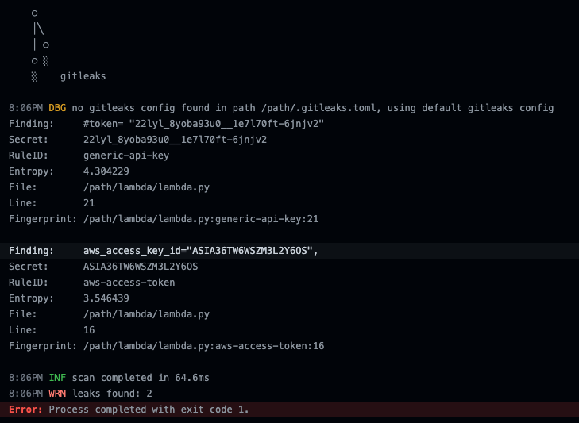

3. Check on gitleaks results for parameters found: *Finding*,*Secret*,*File*,*Line*.
4. Fix flagged code on `lambda.py`, remove commented line that shows #token, and replace secrets value withe string: "test" as per code below (do not copy pointing arrows):

    ```yml
      def get_logs_client():
          """Get AWS logs client either local or real"""

          if IS_DEPLOYMENT:
              return boto3.client("logs", region_name=region_name)
          else:
              return boto3.client(
                  "logs",
                  aws_access_key_id="test",
                  aws_secret_access_key="test",
                  region_name=region_name,
                  endpoint_url="http://localhost:4566",
              )
    ```

5. Save and push your changes.

### Pycharm Security [🔗](https://pycharm-security.readthedocs.io/en/latest/github.html)

- ***PyCharm Security***: This tool allows you to run a security check to your repository.

1. Add the bellow code to the `.github/workflows/ci-app.yml` file:

    ```yml
      pycharm:
        runs-on: ubuntu-latest
        needs: [gitleaks]
        name: Pycharm-security check
        steps:
          - name: checkout git repository
            uses: actions/checkout@v3

          - name: Run PyCharm Security
            uses: tonybaloney/pycharm-security@master
            with: 
              fail_on_warnings: "no"
    ```

2. Save and Push your changes.
3. Check on outputs for Pycharm-security check.

    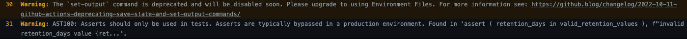

4. Please notice that your pipeline continues even when warnings are flagged, if you want to modify this behaviour and force the pipeline to fail, this can be achieved by adding extra argument: `fail_on_warnings` and set that to `yes`.
5. You can explore this on your own; For the purpose of the demo, let's continue...

### Grype (Anchore) [🔗](https://github.com/marketplace/actions/anchore-container-scan)

- ***Grype (Anchore)***: Vulnerability scanner for container images and filesystems.

1. Add the bellow code to the `.github/workflows/ci-app.yml` file:

    ```yml
      docker-grype-project:
        name: Grype (Anchore) Project Scan
        needs: [gitleaks]
        runs-on: ubuntu-latest
        steps:
          - name: Check out Git repository
            uses: actions/checkout@v3

          - name: Scan current project with Grype (Anchore)
            id: scan-project
            uses: anchore/scan-action@v3
            with:
              path: "."
              fail-build: true
              output-format: table
    ```

2. Save and push your changes.
3. Check pipeline output; You should see the below vulnerability found, since we did specify parameter ***fail-build: true*** the job got failed, but you can change this behaviour by setting the value to ***false***.

    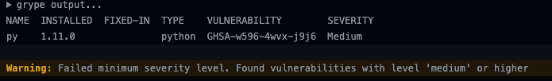

4. Awesome!! Let's continue...

### Build docker image 

1. Add docker build job code block to `.github/workflows/ci-app.yml` file:

    ```yml
      docker-build:
        name: Build Docker image
        outputs:
          full_docker_image_tag: ${{ steps.build_image.outputs.full_docker_image_tag }}
          image_tag: ${{ steps.build_image.outputs.image_tag }}
        runs-on: ubuntu-latest
        needs: [pycharm, docker-grype-project]
        steps:
          - name: Check out Git repository
            uses: actions/checkout@v3

          - name: Add SHORT_SHA and BRANCH_TAG env variables
            run: |
              echo "SHORT_SHA=`echo ${GITHUB_SHA} | cut -c1-8`" >> $GITHUB_ENV
              echo "BRANCH_TAG=`echo ${GITHUB_REF##*/}`" >> $GITHUB_ENV

          - name: Set IMAGE_TAG env variable
            run: |
              echo "IMAGE_TAG=`echo ${BRANCH_TAG}-${SHORT_SHA}`" >> $GITHUB_ENV

          - name: Build and tag image
            id: build_image
            env:
              REGISTRY: ghcr.io
              IMAGE_NAME: ${{ github.repository }}
              ECR_REPOSITORY: ${{ github.repository }}
              IMAGE_TAG: ${{ env.IMAGE_TAG }}
            run: |
              echo REGISTRY: $REGISTRY
              echo ECR_REPOSITORY: $ECR_REPOSITORY
              echo IMAGE_TAG: $IMAGE_TAG
              echo "Building and tagging $REGISTRY/$ECR_REPOSITORY:$IMAGE_TAG ..."
              docker build -t $REGISTRY/$ECR_REPOSITORY:$IMAGE_TAG -f Dockerfile .
              mkdir -p /tmp
              docker save "$REGISTRY/$ECR_REPOSITORY:$IMAGE_TAG" > /tmp/docker-image.tar
              echo "full_docker_image_tag=$REGISTRY/$ECR_REPOSITORY:$IMAGE_TAG" >> $GITHUB_OUTPUT
              echo "image_tag=$IMAGE_TAG" >> $GITHUB_OUTPUT

          - name: Upload artifact
            uses: actions/upload-artifact@v3
            with:
              name: docker-image
              path: /tmp/docker-image.tar
              retention-days: 1
    ```

### docker-trivy [🔗](https://github.com/marketplace/actions/aqua-security-trivy)

- Lets scan our Docker image for vulnerabilities, add *Docker-trivy-vuln* job to pipeline.

1. Add docker trivy job to `.github/workflows/ci-app.yml` file:

    ```yml
      docker-trivy-vuln:
        name: Trivy vulnerability scanner
        runs-on: ubuntu-latest
        needs: [docker-build]
        steps:
          - name: Download artifact
            uses: actions/download-artifact@v3
            with:
              name: docker-image
              path: /tmp
          - name: Load Docker image
            run: |
              docker load --input /tmp/docker-image.tar

          - name: Run Trivy vulnerability scanner
            uses: aquasecurity/trivy-action@master
            with:
              image-ref: "${{ needs.docker-build.outputs.full_docker_image_tag }}"
              hide-progress: false
              format: 'table'
              exit-code: '0'
              ignore-unfixed: false
              severity: 'UNKNOWN,LOW,MEDIUM,HIGH,CRITICAL'
    ```

2. Push your changes.
3. You won't see the pipeline failing, but if you check the logs of the last job you will see that Trivy actually found some security issues:

    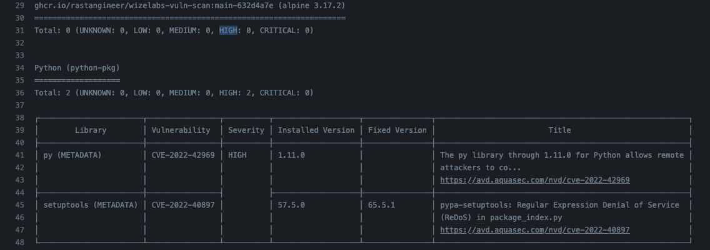

    That is because we are returning a success code even if the scan found issues by setting:

    `exit-code: '0'`

### docker-grype [🔗](https://github.com/marketplace/actions/anchore-container-scan)

- Lets invoke our vulnerability scanner for container images - *Grype*

1. Add below code to our `.github/workflows/ci-app.yml` file:

    ```yml
      docker-grype:
        name: Grype (Anchore) Docker Scan
        runs-on: ubuntu-latest
        needs: [docker-build]
        steps:
          - name: Download artifact
            uses: actions/download-artifact@v3
            with:
              name: docker-image
              path: /tmp

          - name: Load Docker image
            run: |
              docker load --input /tmp/docker-image.tar

          - name: Scan image wih Grype (Anchore)
            id: scan-image
            uses: anchore/scan-action@v3
            with:
              image: "${{ needs.docker-build.outputs.full_docker_image_tag }}"
              output-format: table
              fail-build: true
    ```

2. Push your changes
3. Check pipeline output; You should see the following output:
   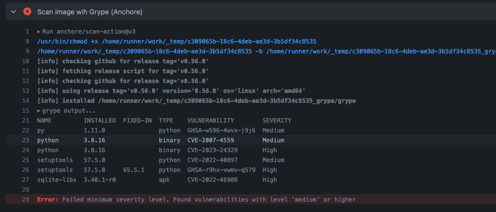
4. Since we specified the parameter `fail-build: true` the job got failed. Change the value to `false` to ignore the issue for now.
5. Push your changes and see the result.

### Deploy Application 🚀

- As a last step, let's simulate the deployment of our application only if all the jobs were succesful.

1. Add the below job and push your changes:

    ```yml
      deploy:
        name: deploy
        runs-on: ubuntu-latest
        needs: [docker-grype,docker-trivy-vuln]
        steps:
          - name: Deploy the thing
            run: |
              echo Deploying 🚀
    ```

2. If pipeline succeeded, you are all set!
3. Happy deploy... 🚀

## Bonus: pre-commit

pre-commit is a tool that allows to automatically execute linting, testing, validations, and other tools before commiting changes.

1. Install [pre-commit](https://pre-commit.com/#install)
2. Install [gitleaks](https://github.com/gitleaks/gitleaks#installing)
3. Run:

    ```bash
    ❯ pre-commit install
    ❯ # add some files (git add)
    ❯ pre-commit run # or try to commit some changes
    ```

4. See output
